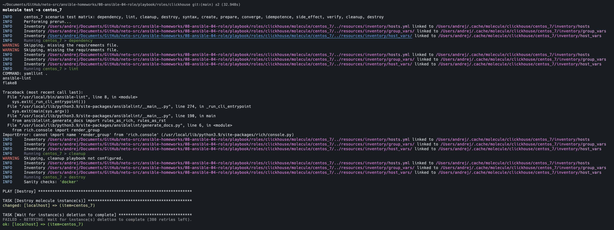
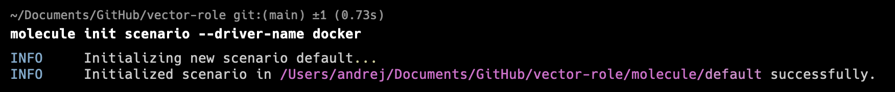
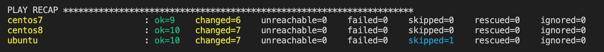
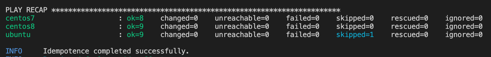
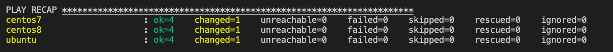
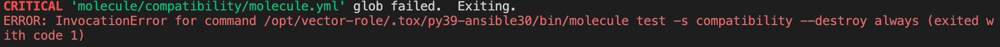
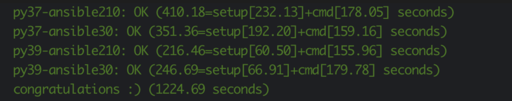

# Домашняя работа к занятию 5 «Тестирование roles»

## Подготовка к выполнению

1. Установите molecule: `pip3 install "molecule==3.5.2"` и драйвера `pip3 install molecule_docker molecule_podman`.
2. Выполните `docker pull aragast/netology:latest` —  это образ с podman, tox и несколькими пайтонами (3.7 и 3.9) внутри.

## Основная часть

Ваша цель — настроить тестирование ваших ролей.

Задача — сделать сценарии тестирования для vector.

Ожидаемый результат — все сценарии успешно проходят тестирование ролей.

### Molecule

1. Запустите  `molecule test -s centos_7` внутри корневой директории clickhouse-role, посмотрите на вывод команды. Данная команда может отработать с ошибками, это нормально. Наша цель - посмотреть как другие в реальном мире используют молекулу.
    > Запустил, в процессе отработало с ошибками, это нормально.
    > 
2. Перейдите в каталог с ролью vector-role и создайте сценарий тестирования по умолчанию при помощи `molecule init scenario --driver-name docker`.
    > 
3. Добавьте несколько разных дистрибутивов (centos:8, ubuntu:latest) для инстансов и протестируйте роль, исправьте найденные ошибки, если они есть.
    > Для корректной работы systemd и исправления проблемы с репозиторием на centos8 были подготовлены инстансы с помощью Dockerfile,
    > Настройка выполнена успешно
    > 
    > Идемпотентность пройдена
    > 
4. Добавьте несколько assert в verify.yml-файл для проверки работоспособности vector-role (проверка, что конфиг валидный, проверка успешности запуска и др.).
    > Добавляем проверку соответствии версии установленного Vector
    > А также проверку наличия конфигов
5. Запустите тестирование роли повторно и проверьте, что оно прошло успешно.
    > Повторный запуск прошел успешно
    > 
6. Добавьте новый тег на коммит с рабочим сценарием в соответствии с семантическим версионированием.
    > Добавлен новый tag [1.0.4](https://github.com/zemlyachev/vector-role/tree/1.0.4)

### Tox

1. Добавьте в директорию с vector-role файлы из [директории](./example).
2. Запустите `docker run --privileged=True -v <path_to_repo>:/opt/vector-role -w /opt/vector-role -it aragast/netology:latest /bin/bash`, где path_to_repo — путь до корня репозитория с vector-role на вашей файловой системе.
    > Запущено
    > docker run --privileged=True -v /Users/andrej/Documents/GitHub/vector-role:/opt/vector-role -w /opt/vector-role -it aragast/netology:latest /bin/bash
3. Внутри контейнера выполните команду `tox`, посмотрите на вывод.
    > Посмотрел на вывод, получаем ошибки, так как сценария compatibility у нас нет
    > 
4. Создайте облегчённый сценарий для `molecule` с драйвером `molecule_podman`. Проверьте его на исполнимость.
5. Пропишите правильную команду в `tox.ini`, чтобы запускался облегчённый сценарий.
6. Запустите команду `tox`. Убедитесь, что всё отработало успешно.
    > Успешно
    > 
7. Добавьте новый тег на коммит с рабочим сценарием в соответствии с семантическим версионированием.
    > Добавлен новый tag [1.0.5](https://github.com/zemlyachev/vector-role/tree/1.0.5)

После выполнения у вас должно получится два сценария molecule и один tox.ini файл в репозитории. Не забудьте указать в ответе теги решений Tox и Molecule заданий. В качестве решения пришлите ссылку на ваш репозиторий и скриншоты этапов выполнения задания.
